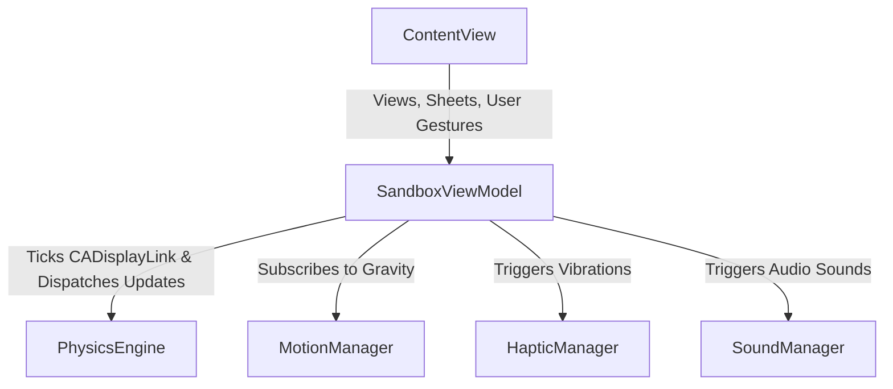

# Physics & Haptics Sandbox

An interactive, high-fidelity 2D physical simulation application for iOS. It combines real-time physical modeling, Core Motion gravity controls, Core Haptics dynamic feedback, and a procedurally synthesized audio engine.

---

## 🏗️ Architecture (Decoupled MVVM)

The project utilizes a decoupled **Model-View-ViewModel (MVVM)** pattern to separate the pure physics model from iOS platform services (audio, haptics, motion).

### Component Roles:
1. **Model ([PhysicsEngine.swift](file:///Users/moreno_m5/Projects/Test-Physics-Haptics/Test-Physics-Haptics/PhysicsEngine.swift))**: A pure Swift physical simulator. It manages physical state (`Ball` structs, boundaries, drag handles) and computes step updates via `updatePhysics(dt:gravityVector:)`, returning a pure `PhysicsStepResult` containing collision events and speed data.
2. **ViewModel (`SandboxViewModel` inside [ContentView.swift](file:///Users/moreno_m5/Projects/Test-Physics-Haptics/Test-Physics-Haptics/ContentView.swift))**: Owns the `CADisplayLink` timer loop, binds to `MotionManager` via Combine for gravity vectors, invokes physics ticks, dispatches collision metrics to audio/haptic manager services, and manages state history (Undo/Redo stacks).
3. **View ([ContentView.swift](file:///Users/moreno_m5/Projects/Test-Physics-Haptics/Test-Physics-Haptics/ContentView.swift))**: Observes the `SandboxViewModel`. Renders the canvas, grid background, spring indicators, settings menus, and relays drag gestures.
4. **Platform Services**:
   * **[HapticManager.swift](file:///Users/moreno_m5/Projects/Test-Physics-Haptics/Test-Physics-Haptics/HapticManager.swift)**: Custom wrapper around Apple `CoreHaptics` for transient and continuous haptic parameters.
   * **[SoundManager.swift](file:///Users/moreno_m5/Projects/Test-Physics-Haptics/Test-Physics-Haptics/SoundManager.swift)**: Real-time procedural audio engine utilizing `AVAudioEngine` and `AVAudioSourceNode` DSP callbacks.
   * **[MotionManager.swift](file:///Users/moreno_m5/Projects/Test-Physics-Haptics/Test-Physics-Haptics/MotionManager.swift)**: Handles device accelerometer reading and axis-locked gravity.

---

## 🧮 Mathematical Model

### 1. Accelerometer Tilt Gravity
Continuous gravity components are read from Core Motion and mapped to the screen coordinates:
$$\vec{g}_{screen} = (g_x, -g_y)$$
The acceleration applied is:
$$\vec{a}_{gravity} = \vec{g}_{screen} \cdot G_{multiplier}$$

* **Axis-Locked Snapping Mode**: When enabled, gravity snaps to the dominant 3D axis. Laying the device flat on a table ($Z$-dominant) cancels all in-plane gravity, whereas tilting snaps it strictly to portrait ($Y$-axis) or landscape ($X$-axis) orientations.

### 2. Rubberband Dragging & 3-Second Direct Follow
* **Rubberband Spring Dragging**: When dragging a ball, a virtual spring pulls the ball toward the touch position:
  $$\vec{F}_{spring} = K \cdot (\vec{p}_{touch} - \vec{p}_{ball})$$
  $$\vec{a}_{drag} = \frac{\vec{F}_{spring}}{m} - C \cdot \vec{v}_{ball}$$
  *Heavier masses naturally exhibit more lag, stretching the spring indicator.*
* **Direct Follow Bypass**: Holding down on a ball for **3 seconds** engages direct finger locking. The spring line disappears, the ball scales up ($1.08\times$) with a blue glow ring, and it follows the finger directly. On release, the throwing velocity is calculated from touch displacement.

### 3. Unified Gauss-Seidel Collision Solver
To prevent resting jitter and numerical instabilities when balls pile up in corners, positions and velocities are resolved using a unified solver loop executing **4 iterations** per frame:
* **Inelastic Contact Threshold**: Normal relative velocities below $55.0\text{ px/s}$ are resolved with a restitution coefficient of $e = 0.0$ (resting contact stabilization).
* **Penetration Separation**: Overlapping circles are separated along their normal vector $\hat{n}$ using their relative inverse masses and a penetration slop ($s = 0.25\text{ pt}$) to prevent micro-oscillations:
  $$\text{If } \text{overlap} > s \implies \text{correctAmount} = (\text{overlap} - s) \cdot 0.85$$
* **Impulse Resolution**: Elastic bounce velocities are exchanged along the collision normal using the average restitution of the colliding objects.

---

## 🔊 Procedural Audio Engine

The app synthesizes all audio dynamically in real-time on a background hardware thread (44.1/48 kHz) without pre-recorded assets.

### 1. Energy Dissipation Impact Synthesis
Impact sound volume is directly mapped to physical kinetic energy loss. During any collision, the normal kinetic energy dissipated is:
$$\Delta E_n = \frac{1}{2} \mu v_{rel, n}^2 (1 - e^2)$$
Where:
* $\mu$ is the reduced mass $\frac{m_1 m_2}{m_1 + m_2}$ (or the ball's mass $m$ for boundaries).
* $v_{rel, n}$ is the relative normal velocity.
* $e$ is the combined restitution coefficient.

Because acoustic energy is proportional to the square of its amplitude ($E_{sound} \propto A^2$), the synthesizer maps:
$$A \propto \sqrt{\Delta E_n}$$

* **Pitch & Decay**: Smaller, lighter balls click higher ($f_0 \propto 75.0 + 750.0 / \sqrt{m}\text{ Hz}$). Harder/more elastic balls ring longer ($\lambda = 65.0 - 48.0 \cdot e$).

### 2. Rolling Sound Source-Filter model
Traversing surface textures is modeled via a Source-Filter approach:
* **The Source (Surface Excitation)**: Combines white noise (via LCG), granular dust crackles, and a cyclic hum representing tire-like rolling rotation over table micro-ridges ($f_{hum} = 25.0 + 0.35 \cdot speed\text{ Hz}$).
* **The Filter (Modal Resonators)**: Excitation is convolved in real-time through three 2-pole resonant filter bands tuned to the ball's natural eigenmodes ($f_0, 1.6 \cdot f_0, 2.3 \cdot f_0$).

---

## 📳 Haptic Texture Modulation

Continuous physics variables are mapped to iOS Core Haptics:
* **Transient Impacts**: Impulse magnitude maps to `hapticTransient` intensity and sharpness.
* **Continuous Dragging & Rolling**: Spring force magnitude and global kinetic energy drive continuous haptic rumbles.
* **Haptic Parameter Anti-Aliasing**: Current haptic intensity and sharpness are interpolated sample-by-sample ($I_c = I_c + (I_t - I_c) \cdot 0.12$) to avoid abrupt hardware ticking.

---

## ⚙️ Interactive Controls & Presets

* **Settings Panel**: Adjust global plane friction, boundary bounciness, master volume, and toggle axis-locked gravity.
* **Summon Panel**: Create custom balls by selecting their size, mass, rolling friction, and bounciness. Shade density dynamically maps to mass/size ratio.
* **Undo / Redo**: Buttons placed in the top settings bar capture snapshots of the simulation's balls list, enabling you to undo/redo ball sumonings, deletions, presets, and resets.
* **Chime Chord Preset**: Generates a 5-ball harmonic chord (C5, E5, G5, A5, C6). Note frequencies are specified in kHz ($0.52325$, $0.65925$, $0.78399$, $0.88000$, $1.04650$) and reversed mathematically to obtain the exact mass required for their collision sounds:
  $$m = \left(\frac{750.0}{f_{Hz} - 75.0}\right)^2$$
